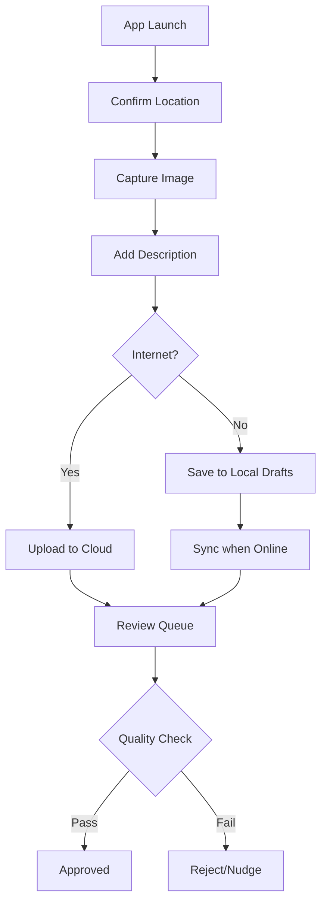

# Task 1: Design a Platform to Collect Images + Descriptions from All Villages of India

## 1. Problem Statement & Goals

AI vision-language models (e.g., CLIP, GPT-4V) are currently trained on global datasets that often lack representation from rural India. They fail to recognize local contexts such as a "handpump in rural Rohtak," a "Durga Puja pandal," or specific "Rath Yatra processions." This creates a cultural and geographic gap in AI's understanding of India's 600,000+ villages.

### Goals

- Build a scalable, low-friction, and resilient platform to collect **1,000 high-quality image-description pairs per village** across all Indian districts.
- Ensure the product is inclusive for field agents with low connectivity and varied devices.
- Provide internal teams with tools to verify and monitor coverage effectively.

---

## 2. User Roles and Goals

### Contributors (Field Agents/Volunteers)

- **Goal**: Capture/upload image + add description + submit.
- **Constraints**: Low connectivity, varied devices, multilingual input, minimal training.

### Reviewers/Admins (Internal Teams)

- **Goal**: Verify quality and ensure full district coverage.
- **Constraint**: High volume of data requiring quick validation.

---

## 3. Contributor Flow Design

### Step-by-Step Experience:

1.  **Accessing the Product**: A mobile web app (PWA) to ensure low storage usage and easy updates.
2.  **Location Setup**: Automatic GPS-based village suggestion with manual overrides (State → District → Village).
3.  **Capture/Upload**: Option to take a real-time photo (preferred for authenticity) or upload from the gallery.
4.  **Add Description**: A text field with multilingual support and character/word count nudges.
5.  **Review & Submit**: A final check of the image and caption before sending.

### Key Design Principles:

- **Offline-First**: Save drafts locally using a sync manager for later upload when internet is restored.
- **Minimalist UI**: Large buttons, clear iconography, and guided steps.
- **Resilience**: Low-resolution thumbnails for quick previews in low-network areas.

---

## 4. Admin / Verification View

### Core Features:

- **Heatmap Dashboard**: A map-based view showing real-time village-level coverage.
- **Advanced Filtering**: Search by state, district, date, or contributor type.
- **Verification Queue**: A grid-based UI showing image-caption pairs for manual "Approve/Reject/Flag" actions.
- **Quality Indicators**: Automatic flags for blurry images or repetitive descriptions.

---

## 5. Edge Scenarios & Solutions

- **Weak/No Internet**: All submissions are cached in a local database (e.g., SQLite/IndexedDB) and uploaded in the background.
- **Low-Quality Input**: Use simple on-device logic (e.g., brightness check, blur detection) to nudge the user _before_ submission.
- **Wrong Location**: If GPS data doesn't match the selected village, the app warns the user and requires a reason (e.g., "Capturing the outskirts").
- **Missing Descriptions**: Implement a minimum word count (e.g., 10 words) and suggest prompts (e.g., "Describe the background").

---

## 6. Summary of Approach

- **Assumptions**: We assume contributors are motivated but limited by technology and environment.
- **Key Metrics**:
  - **Village Coverage %**: Percentage of villages reaching the 1,000-image goal.
  - **Approval Rate**: Ratio of approved to total submissions (aim for >95%).
  - **Sync Latency**: Time from capture to upload completion.
- **Expected Outcomes**: A robust, culturally-aware vision dataset that allows AI models to "see" and understand India authentically.

---

## Wireframe Logic (Conceptual)

